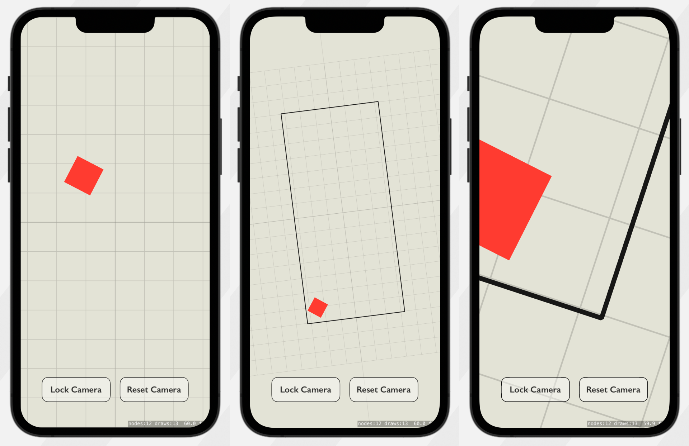

#  SpriteKit Inertial Camera

This is a custom camera for SpriteKit that allows you to freely navigate around the scene.
You can use pan, pinch, and rotation gestures to control the camera.
When the gesture ends, the camera maintain the velocity of the gesture and gradually slows it down over time.

## Screen recording

A GIF (7.3MB, 10fps) is attached below. [Higher quality screen recording](https://www.achrafkassioui.com/images/SpriteKit-Inertial-Camera-Demo.mp4) (18MB).


## Screenshots



## Setup

Add the `InertialCamera` file or class to your project, then create an instance of the camera, for example inside `didMove`:

```swift
override func didMove(to view: SKView) {
    size = view.bounds.size
    let inertialCamera = InertialCamera(view: view, scene: self)
    camera = inertialCamera
    addChild(inertialCamera)
}
```

In order to enable inertia, the `updateInertia` method of the camera can be called inside the `update` function of the scene:

```swift
override func update(_ currentTime: TimeInterval) {
    if let inertialCamera = camera as? InertialCamera {
        inertialCamera.updateInertia()
    }
}
```

## Configuration

Selectively enable or disable inertia for each transformation:

```swift
inertialCamera.enablePanInertia = true
inertialCamera.enableScaleInertia = true
inertialCamera.enableRotationInertia = true
```

Tweak the friction values of the inertia:

```swift
/// lower values = higher friction.
inertialCamera.positionInertia = 0.95
inertialCamera.scaleInertia = 0.75
inertialCamera.rotationInertia = 0.85
```

Set the minimum and maximum zoom levels:

```swift
 /// a max zoom out of 0.01x
inertialCamera.maxScale = 100
 /// a max zoom in of 100x
inertialCamera.minScale = 0.01
```


## Support

Tested on iOS. Not adapted for macOS yet.

