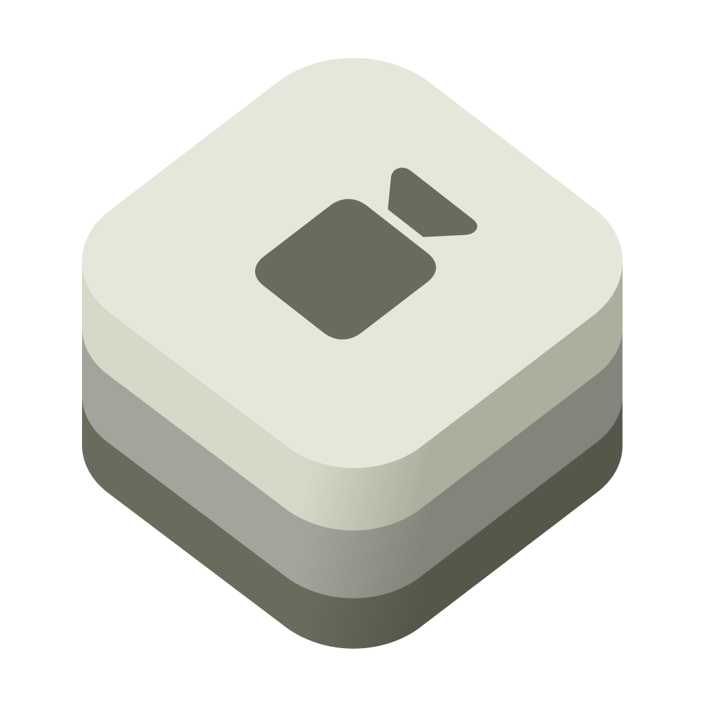

<p align="center">

</p>

#  SpriteKit Inertial Camera

A custom SpriteKit camera designed for smooth navigation in your scene using multi-touch gestures. It supports panning, pinching, and rotating, with inertia applied to each transformation.

The camera is highly customizable, offering a variety of settings and features.

## Video

https://github.com/user-attachments/assets/1346748e-84b0-4c6b-9de7-8e7f59447198

## Run the Demo App

The project includes a demo app that you can compile and run on your device:

- Download or clone this project.
- Open the project in Xcode.
- Update the project's signing settings with your own credentials.
- Select a target device or simulator.
- Build and run with `Command + R`.

Alternatively, you can preview the demo scene without an iOS device:

- Select the demo scene file in Xcode.
- Open the Xcode canvas with `Option + Command + Enter`.

## Getting Started

Copy the camera class to your project, then follow this minimal setup:

```swift
/// Your SpriteKit scene
class MyScene: SKScene, UIGestureRecognizerDelegate {
    
    /// Create camera instance
    let inertialCamera = InertialCamera()
    
    /// Attach to view and scene
    override func didMove(to view: SKView) {
        /// Assign the gesture recognizer delegate before the view
        inertialCamera.gestureRecognizerDelegate = self
        inertialCamera.gesturesView = view
        self.camera = inertialCamera
        addChild(inertialCamera)
    }
    
    /// Update inertia
    override func update(_ currentTime: TimeInterval) {
        inertialCamera.update()
    }
    
    /// Allow simultaneous gestures
    func gestureRecognizer(_ gestureRecognizer: UIGestureRecognizer, shouldRecognizeSimultaneouslyWith otherGestureRecognizer: UIGestureRecognizer) -> Bool {
        return true
    }
    
    /// Stop on touch
    override func touchesBegan(_ touches: Set<UITouch>, with event: UIEvent?) {
        inertialCamera.stop()
    }
    
}
```

## API

### Default Transform

The camera is initialized with a default position, scale, and rotation. You can pass different values during initialization:

```swift
/// Create the camera with specific transforms
let inertialCamera = InertialCamera(
    position: .zero, /// Optional. Default is CGPoint(x: 0, y: 0)
    xScale: 1,       /// Optional. Default is 1
    yScale: 1,       /// Optional. Default is 1
    rotation: 0,     /// Optional. Default is 0
)
```

After initialization, you can set new defaults on these properties:

```swift
inertialCamera.defaultPosition 
inertialCamera.defaultRotation
inertialCamera.defaultXScale
inertialCamera.defaultYScale
```

Use `reset()` to restore all the default transforms:

```swift
inertialCamera.reset()
/// Or pass an optional withAnimation parameter. Default is true
inertialCamera.reset(withAnimation: true)
```

### Animating the Camera

Use `setTo()` to move, scale, or rotate the camera programmatically. Any parameter left as nil keeps its current value.

```swift
inertialCamera.setTo(
    position: CGPoint? = nil,   /// Target position (optional).
    xScale: CGFloat? = nil,     /// Target X scale (optional).
    yScale: CGFloat? = nil,     /// Target Y scale (optional).
    rotation: CGFloat? = nil,   /// Target rotation (optional, in radians).
    withAnimation: Bool? = nil  /// Animate transitions (default is true).
)

/// Example: Zoom out without changing position or rotation
inertialCamera.setTo(xScale: 2, yScale: 2)
```

To stop all camera transformations and animations immediately, use `stop()`:

```swift
inertialCamera.stop()
```

### Inertia

The camera has separate inertia controls for pan, scale, and rotation. The velocity values are applied once per frame by `update()`.

```swift
/// Toggle position inertia.
inertialCamera.enablePanInertia = true

/// Toggle scale inertia.
inertialCamera.enableScaleInertia = true

/// Toggle rotation inertia.
inertialCamera.enableRotationInertia = true
```

You can tune how quickly each velocity decays:

```swift
/// Position velocity is multiplied by this factor every frame. Default is `0.95`.
inertialCamera.positionInertia = 0.95

/// Scale velocity is multiplied by this factor every frame. Default is `0.75`.
inertialCamera.scaleInertia = 0.75

/// Rotation velocity is multiplied by this factor every frame. Default is `0.85`.
inertialCamera.rotationInertia = 0.85
```

If inertia is enabled, you can manipulate the velocities directly

```swift
inertialCamera.positionVelocity = CGVector(dx: 0, dy: 0)
inertialCamera.scaleVelocity = CGVector(dx: 0, dy: 0)
inertialCamera.rotationVelocity: CGFloat = 0
```

### Zoom

SpriteKit cameras use scale for zoom. A lower scale value means the camera is zoomed in. A higher scale value means the camera is zoomed out.

```swift
/// Maximum zoom out. Default is `10`, which is 10% zoom.
inertialCamera.maxScale = 10

/// Maximum zoom in. Default is `1 / 6`, which is 600% zoom.
inertialCamera.minScale = 1 / 6
```

### Lock

You can lock each transform independently, or lock all camera gesture handling.

```swift
/// Lock camera pan.
inertialCamera.lockPan = false

/// Lock camera scale.
inertialCamera.lockScale = false

/// Lock camera rotation.
inertialCamera.lockRotation = false

/// Lock all camera gesture handling.
inertialCamera.lock = false
```

### Gesture View

The camera installs its own UIKit gesture recognizers on `gesturesView`. This can be the `SKView` presenting the scene, or another `UIView` in the same view hierarchy. Assign `gestureRecognizerDelegate` before assigning `gesturesView`.

```swift
inertialCamera.gestureRecognizerDelegate = self
inertialCamera.gesturesView = view
```

The camera's gesture recognizers are configured so they do not cancel or delay normal SpriteKit touch handling. This makes it easier to combine camera navigation with scene interactions such as selecting, dragging, or tapping nodes.

### Clamping

Use `area` to clamp the camera position to a rectangular area centered on the camera parent’s coordinate system. If `area` is `nil`, no position clamping is applied.

```swift
/// Clamp camera movement to this scene-sized area.
inertialCamera.area = CGSize(width: 3000, height: 2000)

/// Remove camera position clamping.
inertialCamera.area = nil
```

### Delegate

The `InertialCameraDelegate` protocol provides methods for tracking camera changes. A common use case is updating the UI when the camera's state changes. For example, in the demo scene, the zoom UI label is updated using the `cameraDidScale` callback.

In the object where you want to listen to camera changes, such as the scene, conform to the `InertialCameraDelegate` protocol and implement its methods:

```swift
class MyScene: SKScene, InertialCameraDelegate {
    
   override func didMove(to view: SKView) {
       //..
       /// Assign the scene as the delegate
       inertialCamera.delegate = self
       //..
    }
    
    func cameraDidMove(to position: CGPoint) {
        /// Handle camera position change
    }
    
    func cameraDidRotate(to angle: CGFloat) {
        /// Handle camera rotation change
    }
    
    func cameraDidScale(to scale: (x: CGFloat, y: CGFloat)) {
        /// Handle camera scale change
    }
    
    /// Track action change
    override func didEvaluateActions() {
        inertialCamera.didEvaluateActions()
    }
    
}
```

The `didEvaluateActions` method is necessary because some of the camera's transformations are performed using SKAction. However, [SKAction does not automatically notify the camera of changes it makes to the camera's properties](https://developer.apple.com/documentation/spritekit/skaction/detecting_changes_at_each_step_of_an_animation) (e.g., position, scale, or rotation). By invoking `didEvaluateActions()` after actions are evaluated, the camera can update its state and ensure that the delegate methods are called with the latest values.

## License

This project is licensed under the Apache License 2.0.

If this project helps your work, attribution or a link back is appreciated:
https://github.com/AchrafKassioui/SpriteKit-Inertial-Camera

## Credits

This project started as a fork of [SKCamera-Demo](https://github.com/HumboldtCodeClub/SKCamera-Demo). Thank you @HumboldtCodeClub for sharing and commenting your code.
